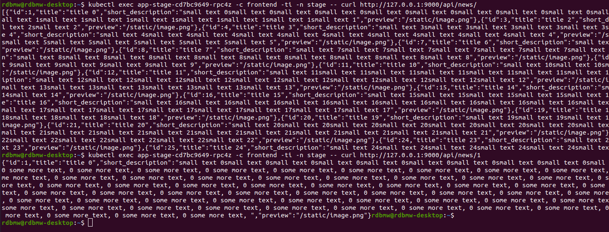

# Домашнее задание к занятию "13.1 контейнеры, поды, deployment, statefulset, services, endpoints"
Настроив кластер, подготовьте приложение к запуску в нём. Приложение стандартное: бэкенд, фронтенд, база данных. Его можно найти в папке 13-kubernetes-config.

## Задание 1: подготовить тестовый конфиг для запуска приложения

### Вопрос
Для начала следует подготовить запуск приложения в stage окружении с простыми настройками. Требования:
* под содержит в себе 2 контейнера — фронтенд, бекенд;
* регулируется с помощью deployment фронтенд и бекенд;
* база данных — через statefulset.

### Ответ

На основе 13-kubernetes-config создаем образы [frontend](https://hub.docker.com/r/rdbmw/front-app) и [backend](https://hub.docker.com/r/rdbmw/back-app) загружаем их на hub.docker.com для дальнейшего использования в манифестах.

Далее, описываем манифесты:
- [stage_ns.yml](src/stage/stage_ns.yml) для создания Namespace stage.
- [statefulset.yml](src/stage/statefulset.yml) для создания StatefulSet на основе образа с БД Postgres.
- [service_db.yml](src/stage/service_db.yml) - Service для возможности доступа бэкенда к БД. 
- [deployment.yml](src/stage/deployment.yml) - описываем Deployment с одним подом и двумя контейнерами frontend и backend.

Применяем манифесты через ```kubectl apply -f``` и проверяем, что все ресурсы созданы и работают. 


Проверим, что бэкенд успешно подключился к БД и сгенерировал демо-данные.


Проверим, что из контейнера фронтенда доступно api бекенда



Сделаем port forward для проверки ответа фронтенда


Фронтенд отвечает, но есть проблема с CORS (не стал пока разбираться как решить)


## Задание 2: подготовить конфиг для production окружения

### Вопрос
Следующим шагом будет запуск приложения в production окружении. Требования сложнее:
* каждый компонент (база, бекенд, фронтенд) запускаются в своем поде, регулируются отдельными deployment’ами;
* для связи используются service (у каждого компонента свой);
* в окружении фронта прописан адрес сервиса бекенда;
* в окружении бекенда прописан адрес сервиса базы данных.

### Ответ

Используем те же образы [frontend](https://hub.docker.com/r/rdbmw/front-app) и [backend](https://hub.docker.com/r/rdbmw/back-app),  

